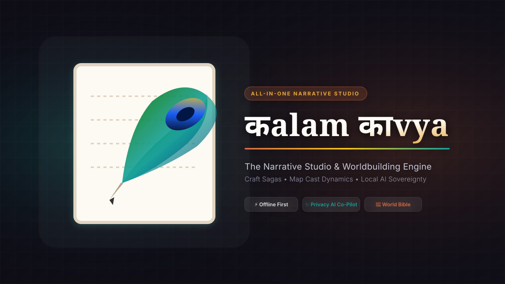

# कalam काvya 🖋️✨



> **The All-in-One Studio & Narrative Engine for Authors, Worldbuilders, and Story Architects.**


-emerald?style=for-the-badge)


_%2B_Cloud-purple?style=for-the-badge)

कalam काvya bridges the gap between distraction-free manuscript drafting, encyclopedic worldbuilding, character cast management, interactive flowcharts, and context-aware artificial intelligence. Whether you are crafting Vedic mythological epics, hard sci-fi sagas, or contemporary romances, कalam काvya gives you complete control over your narrative universe.

---

## 🌟 Key Features

### 🏛️ The 4 Core Pillars

#### 1. ✍️ Manuscript Studio
- **Focus Prose Editor**: Clean, rich-text editor with real-time word counting, target goal progress rings, chapter/scene organization, and focus mode.
- **Drag-and-Drop Scene Planner**: Organize scenes visually across acts, plot points, and narrative arcs using `@dnd-kit`.
- **Visual Index Card Outline**: High-level structural overview with color-coded scene cards and instant status updates.

#### 2. 📚 World Bible & Codex
- **Encyclopedic Lore Categories**: Dedicated management for **Locations, Factions, Magic & Technology Systems, Artifacts, Cultures, Timelines,** and **Codex Entries**.
- **Master Flowcraft Canvas**: Visual node graph network representing entity relationships, entity classes, and process flows powered by `@xyflow/react`.
- **Dynamic Genre Modules**: Specialized worldbuilding schemas for **Vedic & Puranic Myth**, **Sci-Fi**, **Contemporary Rom-Com**, **Epic Fantasy**, and **Gothic Mystery**.
- **Entity Grid & Filter**: Fast visual lookup, custom tags, search, and cross-linked encyclopedic entries.

#### 3. 👥 Cast Studio
- **Character Dossiers**: Comprehensive character profiles featuring psychological motivations, flaws, voice guidelines, and arc trajectory.
- **Relationship Web & Flowchart Matrix**: Map dynamic alliances, rivalries, romantic links, and family hierarchies visually.
- **Art Direction & Avatars**: Color palette generators and prompt tools to visualize character concept art.

#### 4. 🛠️ Author's Toolkit
- **Narrative Templates Library**: Pre-loaded with classic beat sheets including Campbell's *Hero's Journey*, Snyder's *Save the Cat!*, *Vedic Dharmic 4-Purushartha Arc*, *Kishōtenketsu*, and *Cyberpunk Heist*.
- **Gamified Word Sprints**: Custom countdown timer widget with live word velocity tracking and session stats.
- **AI Co-Pilot Drawer**: Brainstorm plot twists, expand prose descriptions, polish dialogue, or generate lore on demand.
- **Multi-Format Specification & Diagram Exporters**: Export JSON specifications, Markdown narrative outlines, and Mermaid diagram syntax.

---

## 🤖 Privacy-First AI Integration

कalam काvya gives you complete data sovereignty:

- **100% Offline Local LLMs**: Connect **Ollama** or **LM Studio** to run models like Llama 3, Mistral, or Gemma on your local GPU with zero internet connection or data leakage.
- **Cloud LLMs**: Connect **OpenAI** (GPT-4o), **Groq** (Instant Llama 3.1), or **OpenRouter** API keys.
- **Context-Aware Prompts**: The AI assistant automatically reads your active scene prose, character dossiers, and world bible context to ensure plot consistency.

---

## ⚡ Keyboard Shortcuts & Power Workflows

| Shortcut | Action |
| :--- | :--- |
| <kbd>Cmd</kbd> / <kbd>Ctrl</kbd> + <kbd>K</kbd> | Open **Global Search** across scenes, characters, & lore |
| Click <kbd>Sparkles</kbd> | Toggle **AI Assistant Drawer** |
| Click <kbd>Timer</kbd> | Launch **Word Sprint Widget** |
| Click <kbd>HelpCircle</kbd> | Re-open the interactive **User Guide & Tour** |

---

## 🛠️ Technology Stack & Architecture

- **Frontend Core**: React 18, TypeScript 5.5, Vite 5
- **Styling**: Tailwind CSS, Vanilla CSS design tokens, Lucide React icons
- **State Management**: Zustand 4 (with devtools & local storage persistence)
- **Local Storage**: IndexedDB via `Dexie.js` (v4) for fast offline project data
- **Rich Text Editor**: TipTap / Quill editor integrations
- **Visual Diagrams & Flow**: `@xyflow/react`, ReactFlow, D3.js, RoughJS, Dagre
- **Desktop Shell**: Tauri (`@tauri-apps/api`)
- **Testing & Quality**: Vitest 4, ESLint 8 (0-warning policy)

---

## 🚀 Getting Started

### Prerequisites

Ensure you have the following installed on your machine:
- [Node.js](https://nodejs.org/) (v18.0.0 or higher)
- `npm` (or `pnpm` / `yarn`)
- *(Optional for Desktop builds)* [Rust & Tauri Prerequisites](https://tauri.app/v1/guides/getting-started/prerequisites)

### 1. Clone the Repository

```bash
git clone https://github.com/rajasgames/kalam-kavya.git
cd kalam-kavya
```

### 2. Install Dependencies

```bash
npm install
```

### 3. Run Development Server

```bash
npm run dev
```

Open `http://localhost:5173` in your browser to start writing!

### 4. Code Quality & Linting

Enforces strict zero-warning policy across TypeScript and React hooks:

```bash
npm run lint
```

### 5. Running Unit Tests

Run the full Vitest suite testing stores, database initializers, and sample data seeding:

```bash
npm run test
```

### 6. Build for Production

```bash
npm run build
```

---

## 📖 First-Time User Onboarding

कalam काvya includes a built-in 5-step interactive **User Guide & Tour**. First-time users will automatically see the tour upon initial launch, offering:
1. An overview of the story studio philosophy.
2. Interactive walkthrough of the 4 Core Pillars.
3. Local & Cloud AI setup instructions.
4. Shortcut cheat sheets.
5. Instant load buttons for pre-built sample worlds (**Vedic Myth**, **Mumbai Rom-Com**, and **Generation Ship Sci-Fi**).

---

## 🚧 Ongoing Project Status & Active Roadmap

कalam काvya is an actively developed narrative engine. Ongoing priorities include:
- [x] Complete Vitest coverage for state management stores (`storyStore`, `aiStore`, `uiStore`, `searchStore`)
- [x] React Fast Refresh compliance & 0-warning ESLint policy
- [x] Flowcraft Master Canvas integration for World Bible entities
- [ ] Export engine enhancements (Direct EPUB & PDF compilation)
- [ ] Advanced character timeline sequence analyzer

---

## 📄 License

Private & Proprietary. Developed for narrative architects and authors.
